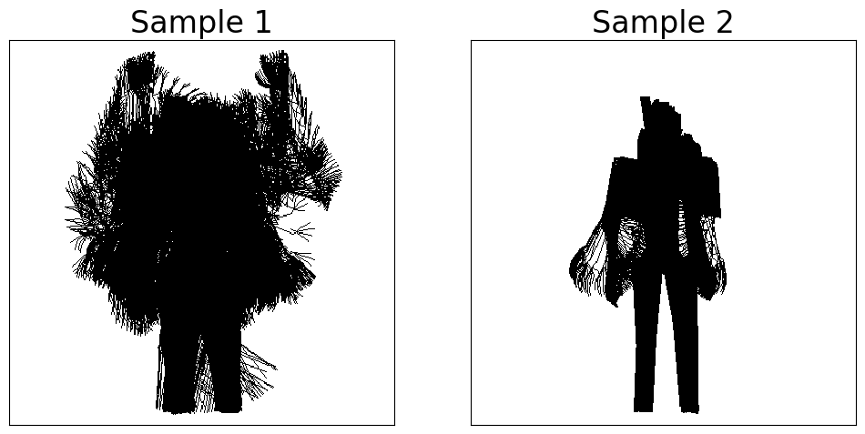
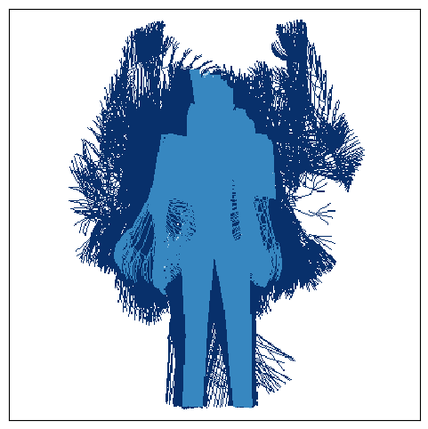

# Gesture Area Coverage

Implementaion of the paper Gesture Area Coverage to Assess Gesture Expressiveness and Human-Likeness.

Gesture Area Coverage (GAC) explicitly considers the spatial coverage of gestures within motion sequences and it is useful for evaluating the expressiveness of co-speech gestures.

Refer to the Section `Usage` for an example to compare two sequences using the GAC analysis and to reproduce the paper follow the instructions in the Section `Paper Results`.

# Usage

Consider the two bvh files available in ` dataset/bvh_sample `:


Import them and read both files
```python
import bvhsdk
sample1 = bvhsdk.ReadFile('./dataset/bvh_sample/sample1.bvh')
sample2 = bvhsdk.ReadFile('./dataset/bvh_sample/sample2.bvh')
```

Compute the joint position for each file in the shape (frames, number of joints, 3):

```python
def getJointPositions(anim):
    joint_positions = []
    for frame in range(anim.frames):
        joint_positions.append([joint.getPosition(frame) for joint in anim.getlistofjoints()])
    return np.array(joint_positions)

pos1, pos2 = getJointPositions(sample1), getJointPositions(sample2)
```

The Gesture Area Coverage is the union of the rasterized poses in a motion sequence. Rasterize both poses:

```python
from GAC import rasterizer
grid1 = rasterizer.rasterize(pos1, sample1.arrayParent(), frame_skip=1, weigth=1)
grid1.clipped = np.clip(grid1.grid, 0, 1)

grid2 = rasterizer.rasterize(pos2, sample2.arrayParent(), frame_skip=1, weigth=1)
grid2.clipped = np.clip(grid2.grid, 0, 1)
```

Plot both GAC representations:

```python
import matplotlib.pyplot as plt
fig, axs = plt.subplots(ncols=2, nrows=1, figsize=(12,12))
axs[0].imshow(grid1.clipped, cmap='binary')
axs[1].imshow(grid2.clipped, cmap='binary')
axs[0].set_title('Sample 1')
axs[1].set_title('Sample 2')
params = {'axis':'both', 'which':'both', 'bottom':False, 'left':False, 'labelleft':False, 'labelbottom':False}
axs[0].tick_params(**params)
axs[1].tick_params(**params)
```



Now, compare both representations using sample 1 and sample 2 as reference and test motion sequence, respectively

```python
from GAC import gac
stats = gac.SetStats(grid1.clipped, grid2.clipped)

from tabulate import tabulate
header = ["Dice", "FP/FN", "RC", "TGAC1", "TGAC2", "TP", "FP", "FN"]
table = [[stats[0], stats[1], stats[2], stats[3], stats[4], stats[5], stats[6], stats[7]]]
print(tabulate(table, header, tablefmt="github"))
```

|     Dice |      FP/FN |       RC |   TGAC1 |   TGAC2 |    TP |   FP |    FN |
|----------|------------|----------|---------|---------|-------|------|-------|
| 0.592506 | 0.00109073 | -6.82091 |   60195 |   25394 | 25356 |   38 | 34839 |

The table presents a set of GAC metrics defined as follows:

* Total GAC 1 (TGAC1): the total area of the reference motion sequence, i.e., total number of occupied pixels (in this case, Sample 1).
* Total GAC 2 (TGAC2): the total area of the test motion sequence (Sample 2).
* True Positive (TP): area shared by both sequences.
* False Positive (FP): area covered by the test sequence and not covered by the reference sequence.
* False Negative (FN): area covered by the reference sequence and no covered by the test sequence.
* Dice Score: similarity between sequences, defined as $2*FP/(TGAC1+TGAC2)$.
* Relative Coverage (RC): indicates how much the test sequence covers or undercovers the reference sequence, defined as $log(FP/FN) = log(FP) - log(FN)$

These metrics are depicted in the following figure, where dark blue is FN, medium blue is TP, light blue is FP (barely visible in this case):

```python
grid2.clipped = grid2.clipped.astype(float)
grid2.clipped[np.logical_and(grid2.clipped==0, grid1.clipped==0)]=np.nan
fig, ax = plt.subplots(figsize=(6,6))
ax.imshow(grid1.clipped-grid2.clipped+1, cmap='Blues', interpolation='none', vmin=-1)
ax.tick_params(**params)
```




# Paper Results

This repository provides:
* Dockerfile to replicate the results
* Code for processing the original data. The processed data is available here
* Code for computing the Gesture Area Coverage (GAC). GAC results used to create the figures and tables in the paper are provided in /GAC/output/ as npy and csv files
* Modified version used for computing the Fréchet Gesture Distance (FGD). The /FGD/output/ folder provides the FGD checkpoint used in the paper and the training log
* Code for plotting the figures used in the paper. The figures are also provided in /figures/

## 1. Preparing environment

The environment is available using Docker. 

To create the environment in Docker:

1. Create docker image using:

```sh
docker build -t gac .
```

2. Run container. Example:

```sh
docker run --rm -it --gpus device=0 --userns=host --shm-size 64G -v /my_dir/gesture-area-coverage:/workspace/gac/ -p '8880:8880' --name gac_container gac:latest /bin/bash
```

3. Enter container and go to the mapped folder ` cd /workspace/gac `.

## Data pre-processing

1. Get the GENEA Challenge 2023 dataset [here](https://zenodo.org/records/8199133), the Submitted Entries to the challenge [here](https://zenodo.org/records/8146028), follow the procedures detailed in the ZEGGS official repository [here](https://github.com/ubisoft/ubisoft-laforge-ZeroEGGS/tree/main?tab=readme-ov-file#zeggs-dataset) and put everything into ` /dataset/ ` as:

📂 dataset\
 ┣ 📂 Genea2023\
 ┃ ┣ 📂 trn\
 ┃ ┃ ┣ 📂 ...\
 ┃ ┣ 📂 val\
 ┃ ┃ ┣ 📂 ...\
 ┃ ┣ 📂 tst\
 ┃ ┃ ┣ 📂 ...\
 ┣ 📂 SubmittedGenea2023\
 ┃ ┣ 📂 BVH\
 ┃ ┃ ┣ 📂 BD\
 ┃ ┃ ┣ 📂 BM\
 ┃ ┃ ┣ 📂 SA\
 ┃ ┃ ┣ 📂 ...\
 ┣ 📂 ZEGGS\
 ┃ ┣ 📄 001_Neutral_0_x_1_0.bvh\
 ┃ ┣ 📄 001_Neutral_1_x_1_0.bvh\
 ┃ ┣ 📄 ...\

2. Run:

```sh
python -m process_dataset
```

The script will create a ` /processed/ ` folder inside each folder that contains BVH files. The processed folder will contain npy files with the 3D positions of each joint of all BVH files in the respective folder.

## Train FGD

To train the FGD from scratch:

1. Run

```sh
python -m FGD.train_AE
```

The training log and the model checkpoint with lowest loss value in the validation set of the GENEA Challenge 2023 will be saved in the folder ` /FGD/output/ `. 

## Compute FGD and GAC

To compute all the results presented in the paper:

1. Run:

```sh
python -m main
```

The scipt will create the figures in the ` /figures/ ` folder and save the results of the metrics as csv and npy in the ` /GAC/output/ ` folder.

## Results

The output of the script is depicted bellow.

Complete result of the GAC metrics for the GENEA Challenge 2023:

| Entry   | Dice        | FP/FN       | RC           | TGAC (x 10e3)   | TP (x 10e3)   | FP (x 10e3)   | FN (x 10e3)   |
|---------|-------------|-------------|--------------|-----------------|---------------|---------------|---------------|
| NA      | -           | -           | -            | 31.67 ± 8.40    | -             | -             | -             |
| SG      | 0.76 ± 0.09 | 2.11 ± 5.65 | -0.21 ± 1.15 | 30.43 ± 5.55    | 23.83 ± 6.08  | 6.60 ± 4.00   | 7.84 ± 3.46   |
| SF      | 0.77 ± 0.10 | 1.85 ± 5.50 | -0.47 ± 1.19 | 29.39 ± 5.69    | 23.98 ± 6.45  | 5.41 ± 4.05   | 7.69 ± 3.17   |
| SJ      | 0.72 ± 0.07 | 0.38 ± 1.15 | -2.68 ± 1.59 | 20.22 ± 3.69    | 18.75 ± 4.51  | 1.47 ± 2.10   | 12.92 ± 5.00  |
| SL      | 0.68 ± 0.09 | 0.40 ± 0.94 | -2.23 ± 1.48 | 20.24 ± 1.84    | 17.79 ± 3.75  | 2.45 ± 3.38   | 13.88 ± 5.45  |
| SE      | 0.71 ± 0.08 | 0.69 ± 1.39 | -1.28 ± 1.27 | 23.96 ± 2.71    | 20.10 ± 4.44  | 3.86 ± 3.27   | 11.57 ± 4.94  |
| SH      | 0.65 ± 0.14 | 0.47 ± 0.92 | -2.14 ± 1.91 | 20.85 ± 6.97    | 17.66 ± 6.77  | 3.18 ± 3.48   | 14.01 ± 5.94  |
| BD      | 0.66 ± 0.11 | 0.22 ± 0.42 | -2.48 ± 1.33 | 18.75 ± 5.78    | 16.98 ± 5.92  | 1.77 ± 1.71   | 14.69 ± 5.32  |
| SD      | 0.70 ± 0.11 | 0.33 ± 0.84 | -2.18 ± 1.43 | 20.76 ± 4.88    | 18.61 ± 5.52  | 2.15 ± 2.21   | 13.06 ± 5.13  |
| BM      | 0.71 ± 0.11 | 0.31 ± 0.84 | -2.31 ± 1.51 | 20.75 ± 6.60    | 18.93 ± 6.52  | 1.82 ± 1.64   | 12.74 ± 5.50  |
| SI      | 0.74 ± 0.08 | 2.32 ± 5.19 | 0.07 ± 1.02  | 31.80 ± 4.46    | 23.76 ± 5.71  | 8.04 ± 3.77   | 7.91 ± 3.53   |
| SK      | 0.72 ± 0.11 | 2.16 ± 4.05 | -0.18 ± 1.32 | 30.49 ± 6.12    | 22.90 ± 5.94  | 7.59 ± 5.70   | 8.78 ± 5.05   |
| SA      | 0.66 ± 0.09 | 3.80 ± 7.62 | 0.73 ± 0.90  | 38.54 ± 3.28    | 23.55 ± 5.23  | 14.98 ± 4.63  | 8.12 ± 3.94   |
| SB      | 0.68 ± 0.08 | 1.19 ± 2.32 | -0.68 ± 1.15 | 26.19 ± 4.51    | 19.92 ± 4.79  | 6.27 ± 4.24   | 11.75 ± 5.13  |
| SC      | 0.64 ± 0.12 | 6.35 ± 5.96 | 1.54 ± 0.76  | 49.20 ± 3.43    | 26.24 ± 6.84  | 22.95 ± 6.78  | 5.43 ± 2.61   |

FGD and Dice correlation with Human-likeness median and mean ratings:

| Correlation             | FGD vs Hum. Median   | Dice vs Hum. Median   |
|-------------------------|----------------------|-----------------------|
| Spearman (p-value)      | -0.17 (0.55)         | 0.47 (0.09)           |
| Kendall's tau (p-value) | -0.12 (0.55)         | 0.34 (0.09)           |


| Correlation             | FGD vs Hum. Mean   | Dice vs Hum. Mean   |
|-------------------------|--------------------|---------------------|
| Spearman (p-value)      | -0.22 (0.45)       | 0.50 (0.07)         |
| Kendall's tau (p-value) | -0.16 (0.45)       | 0.38 (0.06)         |

Complete result of the GAC metrics for the ZEGGS dataset:

| Style        | Dice        | FP/FN             | RC           | TP (x 10e3)   | FP (x 10e3)   | FN (x 10e3)   |
|--------------|-------------|-------------------|--------------|---------------|---------------|---------------|
| Sad          | 0.79 ± 0.04 | 0.70 ± 0.27       | -1.58 ± 0.48 | 37.22 ± 3.59  | 4.06 ± 0.93   | 15.00 ± 3.59  |
| Happy        | 0.74 ± 0.01 | 1072.08 ± 1564.83 | 4.71 ± 0.78  | 51.54 ± 0.23  | 34.19 ± 2.74  | 0.68 ± 0.23   |
| Relaxed      | 0.83 ± 0.01 | 9.47 ± 3.08       | 1.27 ± 0.32  | 47.18 ± 1.02  | 13.99 ± 1.45  | 5.04 ± 1.02   |
| Old          | 0.74 ± 0.04 | 0.65 ± 0.28       | -1.12 ± 0.53 | 34.47 ± 3.53  | 6.47 ± 1.40   | 17.75 ± 3.53  |
| Angry        | 0.83 ± 0.01 | 9.16 ± 3.35       | 1.01 ± 0.28  | 46.12 ± 1.28  | 12.12 ± 1.30  | 6.10 ± 1.28   |
| Agreement    | 0.81 ± 0.01 | 1.13 ± 0.58       | -1.21 ± 0.87 | 39.02 ± 3.44  | 5.17 ± 3.03   | 13.20 ± 3.44  |
| Disagreement | 0.78 ± 0.02 | 0.52 ± 0.15       | -1.84 ± 0.22 | 35.46 ± 0.85  | 3.64 ± 0.98   | 16.76 ± 0.85  |
| Flirty       | 0.77 ± 0.02 | 1.19 ± 0.41       | -0.42 ± 0.28 | 38.56 ± 2.19  | 8.86 ± 0.63   | 13.66 ± 2.19  |
| Pensive      | 0.81 ± 0.01 | 1.33 ± 0.38       | -0.50 ± 0.29 | 40.52 ± 1.15  | 7.59 ± 1.21   | 11.70 ± 1.15  |
| Scared       | 0.73 ± 0.03 | 1.00 ± 0.32       | -0.45 ± 0.41 | 36.51 ± 1.82  | 10.68 ± 2.85  | 15.71 ± 1.82  |
| Distracted   | 0.78 ± 0.04 | 1.10 ± 0.62       | -0.95 ± 0.74 | 37.93 ± 4.26  | 6.15 ± 1.64   | 14.29 ± 4.26  |
| Sarcastic    | 0.82 ± 0.01 | 1.90 ± 0.57       | -0.37 ± 0.31 | 41.56 ± 1.22  | 7.08 ± 0.95   | 10.66 ± 1.22  |
| Threatening  | 0.79 ± 0.05 | 1.41 ± 0.84       | -0.80 ± 0.85 | 39.45 ± 5.59  | 6.73 ± 2.01   | 12.77 ± 5.59  |
| Still        | 0.32 ± 0.06 | 0.04 ± 0.02       | -7.06 ± 0.28 | 10.49 ± 2.33  | 1.13 ± 0.49   | 41.73 ± 2.33  |
| Laughing     | 0.70 ± 0.02 | 0.47 ± 0.04       | -1.20 ± 0.06 | 32.13 ± 1.34  | 6.93 ± 0.03   | 20.09 ± 1.34  |
| Sneaky       | 0.84 ± 0.01 | 30.29 ± 31.98     | 1.31 ± 0.54  | 46.98 ± 0.83  | 12.50 ± 1.58  | 5.24 ± 0.83   |
| Tired        | 0.72 ± 0.03 | 0.94 ± 0.25       | -0.45 ± 0.25 | 35.75 ± 2.29  | 10.59 ± 1.37  | 16.47 ± 2.29  |
| Speech       | 0.77 ± 0.02 | 3.09 ± 1.49       | 0.70 ± 0.46  | 43.83 ± 2.79  | 16.39 ± 1.95  | 8.39 ± 2.79   |

# Cite

Please consider citing our paper:

```text
@inproceedings{tonoli2023gesture,
  title={Gesture Area Coverage to Assess Gesture Expressiveness and Human-Likeness},
  author={Tonoli, Rodolfo L and Costa, Paula Dornhofer Paro and Marques, Leonardo B de MM and Ueda, Lucas H},
  booktitle={Companion Publication of the 26th International Conference on Multimodal Interaction},
  pages={N/A},
  year={2024}
}
```